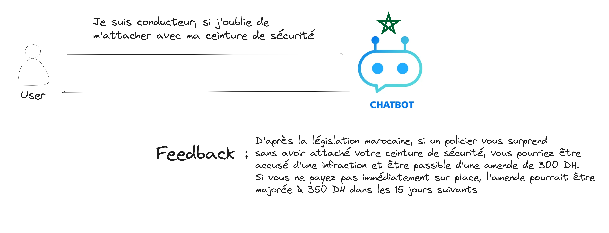
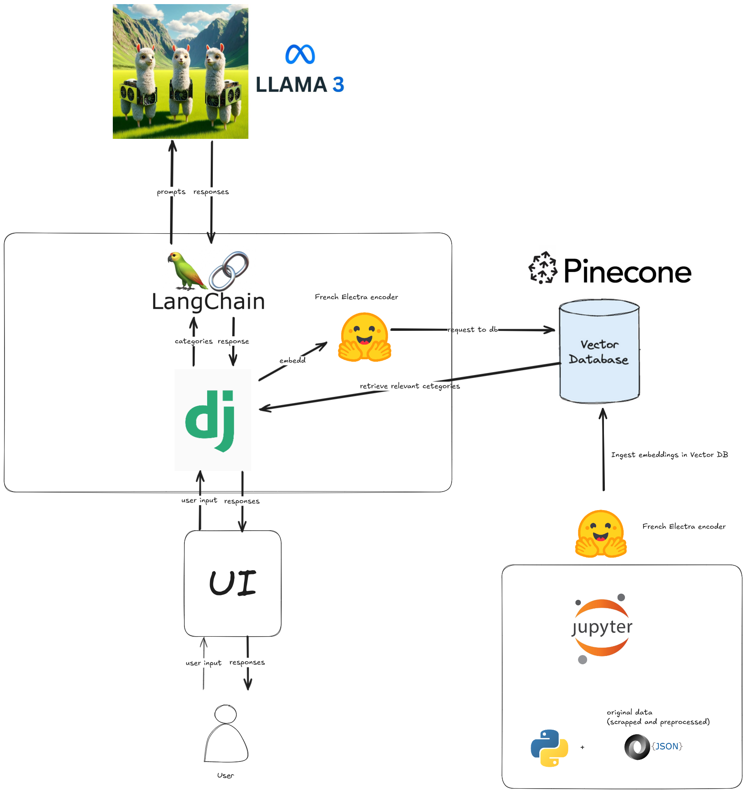

# Moroccan Traffic Violation Chatbot (Tchat)

## Abstract

### Background and Problem Statement
Understanding and adhering to traffic laws is essential for ensuring road safety and reducing violations. Many drivers in Morocco struggle with comprehending the traffic violation laws due to language barriers and the complexity of regulations. This often results in increased traffic violations and misunderstandings of legal consequences.



### Impact and Proposed Solution
The **Moroccan Traffic Violation Chatbot (Tchat)** addresses this issue by providing an accessible, multilingual chatbot that educates users about Moroccan traffic laws in **French** and **Arabic**. Leveraging advanced NLP and ML technologies, the chatbot categorizes traffic violations into 18 categories and offers user-friendly explanations tailored to the user’s language preference. This solution promotes safer driving practices and empowers users with better knowledge of traffic laws.
In the [notebooks/analysis.ipynb](./notebooks/analysis.ipynb) We have explored that we can categorize the moroccan amendements to 18 category, after some feature engineering.
### Project Outcomes and Deliverables
1. **Interactive Chatbot**: Enables users to query Moroccan traffic laws.
2. **Categorized Traffic Violations**: Organized into 18 distinct categories for easy retrieval.
3. **Multilingual Responses**: Support for both French and Arabic.
4. **Backend System**: Built with Django for seamless integration.
5. **Frontend Interface**: Developed using HTML, CSS, and JavaScript.
6. **Embedding Database**: Powered by Pinecone for efficient data retrieval.

---

## Technologies Used

- **Backend**: Django
- **Frontend**: HTML, CSS, and JavaScript (Yes we old school)
- **Embedding Model**: [Electra-French](https://huggingface.co/antoinelouis/biencoder-electra-base-mmarcoFR)
- **LLM**: Llama3-8b-8192 for multilingual response generation
- **Vector Database**: Pinecone for storing and querying embeddings
- **Prompt Engineering**: LangChain for effective prompt generation

---

## Solution Design



The chatbot integrates a pipeline where user queries are embedded using **Electra-French**, matched to the most relevant traffic law category in **Pinecone**, and processed through **Llama3-8b-8192** to generate natural responses in French or Arabic.


## To run : 
1. clone repo
```bash
git clone https://github.com/amine759/ChatTrafficViolation.git
```

- navigate inside the project directory 
```bash
cd ChatTrafficViolation
```

2. install and create virtual environnement in your local machine 
```bash
python3 -m venv venv # install virtual environnement
. venv/bin/activate # this is a linux command only
```

3. install all necessary dependencies 
```bash
pip install -r requirements.txt
```
4. apply django migrations
```bash
python3 manage.py migrate # 
```

5. finally run django server
```bash
python3 manage.py runserver # 
```
**Note** : to make the chat assistant work you will need our **Pinecone** api key, we did not upload it :)
you can use your own Llama3-8b-8192 API KEY.

## Demo recording 
[Demo-video/](./Demo-video) 
